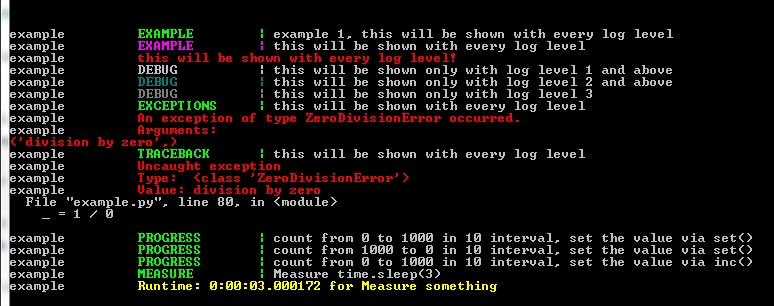

# bbutils

Collection of code I use frequently in many of my projects. Especially the logging feature.

### Features

* Logging to console (colored) and file, in can be extended via additional writer via a plugin feature. The logging is done directly, but also can be done via a thread and a simple buffer.  

## Installation

You can install unqlite using `pip`.

    pip install bbutils

## Basic logging usage

Below is a sample designed to show some of the basic features and functionality of the logging library.

### Step 1: Setup

To begin, instantiate an ``Logging`` object.  Then do the setup via `log.setup(**kwargs)`.

```pycon
log = Logging()
log.setup(app="example", level=3)
```

###### Possible values for setup():

* **app**: Application name
* **use_thread**: use threaded output
* **interval**: update interval for threaded mode in seconds
* **level**: verbose level (integer)
* **index**: dictionay with a lookup table for the different commands for each verbose level

###### Verbose level and the commands

```pycon
index = {
    0: ["INFORM", "WARN", "ERROR", "EXCEPTION", "TIMER", "PROGRESS"],
    1: ["INFORM", "DEBUG1", "WARN", "ERROR", "EXCEPTION", "TIMER", "PROGRESS"],
    2: ["INFORM", "DEBUG1", "DEBUG1", "WARN", "ERROR", "EXCEPTION", "TIMER", "PROGRESS"],
    3: ["INFORM", "DEBUG1", "DEBUG2", "DEBUG3", "WARN", "ERROR", "EXCEPTION", "TIMER", "PROGRESS"]
}
```

### Step 2: Output writer

* console
* file

```pycon
    # We want console and file logging
    console = log.get_writer("console")
    fileio = log.get_writer("file")

    # file name to log to
    filename = os.path.abspath(os.path.normpath("{0:s}/run-tests.log".format(os.getcwd())))

    # setup file and console output, set filename and filler for space for readable output.
    console.setup(text_space=15)
    fileio.setup(text_space=15, filename=filename)
```

###### Possible values for console.setup():

* **text_space**: number of space fillers for application name and tag
* **seperator**: seperator for tags and content, currently '|' as default
* **error_index**: list of commands (see _Verbose level and the commands_) redirected to **_stderr_**
* **bar_len**: length of progress bar


###### Possible values for file.setup():

There are two modes for the file output. First is setting the filename directly. The second is setting filename, logname and logpath. The second enables to append a date and time value to the output filename.

* **text_space**: number of space fillers for application name and tag
* **append_data**: continue old logfile (only for filename)
* **filename**: filename for logfile (excludes **_logname_**, **_logpath_** and **_append_datetime_**)
* **logname**: general name for logfile (example logname=example will result in a filename of <path>/exaple_2020-01-01_00.00.00.log)
* **logpath**: path to store the logfile, works only with **_logname_**
* **append_datetime**: add datetime to **_logname_** and **_logpath_**


### Step 3: Register writer

Its possible to create self written writer and use these. Look in bbutil.logging.types for the `Writer` class and the `Message` class.

```pycon
    # register the output
    log.register(console)
    log.register(fileio)
```

### Step 4: Use the class

* inform(tag: str, content: str)
* warn(tag: str, content: str)
* debug1(tag: str, content: str)
* debug2(tag: str, content: str)
* debug3(tag: str, content: str)
* error(content: str)
* exception(e: Exception)
* traceback()
* progress(limit: int, interval: int = 0)
* timer(content: str)

###### Example for 'inform'

```
log.inform("EXAMPLE", "example 1, this will be shown with every log level")

example         EXAMPLE        | example 1, this will be shown with every log level
```


### example.py

see file [here](example.py)



```pycon
import os
import time
from bbutil.logging import Logging


if __name__ == '__main__':

    log = Logging()

    # Setup the logging, appicatio name is 'example', log level is 2
    log.setup(app="example", level=3)

    # We want console and file logging
    console = log.get_writer("console")
    fileio = log.get_writer("file")

    # file name to log to
    filename = os.path.abspath(os.path.normpath("{0:s}/run-tests.log".format(os.getcwd())))

    # setup file and console output, set filename and filler for space for readable output.
    console.setup(text_space=15)
    fileio.setup(text_space=15, filename=filename)

    # register the output
    log.register(console)
    log.register(fileio)

    # switch logging on
    log.open()

    # example 1, this will be shown with every log level
    log.inform("EXAMPLE", "example 1, this will be shown with every log level")

    # example 2, this will be shown with every log level
    log.warn("EXAMPLE", "this will be shown with every log level")

    # error example, this will be shown with every log level
    log.error("this will be shown with every log level!")

    # debug 1 example, this will be shown only with log level 1 and above
    log.debug1("DEBUG", "this will be shown only with log level 1 and above")

    # debug 2 example, this will be shown only with log level 2 and above
    log.debug2("DEBUG", "this will be shown only with log level 2 and above")

    # debug 3 example, this will be shown only with log level 3
    log.debug3("DEBUG", "this will be shown only with log level 3")

    # show exceptions, this will be shown with every log level
    log.inform("EXCEPTIONS", "this will be shown with every log level")

    try:
        _ = 1 / 0
    except ZeroDivisionError as e:
        log.exception(e)

    # show traceback, this will be shown with every log level
    log.inform("TRACEBACK", "this will be shown with every log level")
    try:
        _ = 1 / 0
    except ZeroDivisionError:
        log.traceback()

    # show a progress meter via console
    # first parameter: limit of the counter
    # second parameter: update interval
    # the update interval is there to prevent flickering, it also reduces the load
    log.inform("PROGRESS", "count from 0 to 1000 in 10 interval, set the value via set()")
    count1 = 0
    progress1 = log.progress(1000, 10)

    while True:
        progress1.set(count1)
        time.sleep(0.0001)

        count1 += 1

        if count1 > 1000:
            break

    # to remove the progress bar use clear
    log.clear()

    # it also can be used backwards
    log.inform("PROGRESS", "count from 1000 to 0 in 10 interval, set the value via set()")
    count2 = 1000
    progress2 = log.progress(1000, 10)
    progress2.counter = 1000

    while True:
        progress2.set(count2)
        time.sleep(0.0001)

        count2 -= 1

        if count2 == 0:
            break

    # to remove the progress bar use clear
    log.clear()

    # now we use inc instead of setting the value
    log.inform("PROGRESS", "count from 0 to 1000 in 10 interval, set the value via inc()")
    count3 = 0
    progress3 = log.progress(1000, 10)

    while True:
        progress3.inc()
        time.sleep(0.0001)

        count3 += 1

        if count3 > 1000:
            break

    # to remove the progress bar use clear
    log.clear()

    log.inform("MEASURE", "Measure time.sleep(3)")
    timer1 = log.timer("Measure something")
    time.sleep(3)
    timer1.stop()
```
